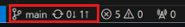
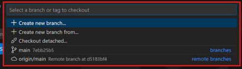
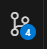
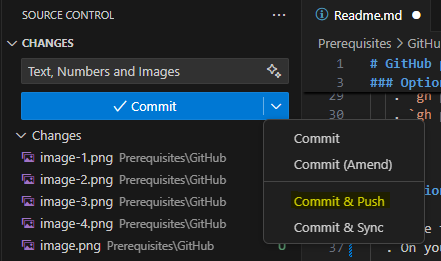
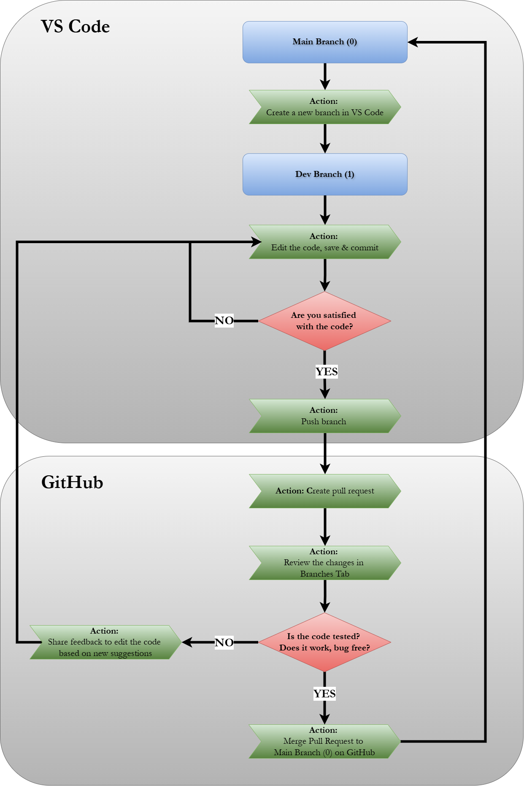

# GitHub Prerequisities

## Option A: Using GitBash

### 1. Clone the repo  
  - Open your GitBash terminal  
  - `git clone https://github.com/you/your-repo.git`  
  - `cd your-repo`

### 2. Create & switch to a new branch  
  - `git checkout -b feature/my-change`

### 3. Make changes & commit locally  
  - Edit files in your favorite editor
  - Check the status of changes: `git status`
  - Stage files for commit: `git add <file1> <file2>` (or `git add .` to stage all)  
  - Commit changes: `git commit -m "Short, descriptive message"`

### 4. Push branch to GitHub  
  - `git push --set-upstream origin feature/my-change`

### 5. Create a Pull Request  
  - (Option 1: Web) Visit your repo, click **Compare & pull request** button
  - (Option 2: CLI with GitHub CLI), `gh pr create --fill`

### 6. Merge & clean up  
  - (Option 1: Web) Click **Merge pull request**, then **Delete branch**  
  - (Option 2: CLI with GitHub CLI)  
    - `gh pr merge --merge`  
    - `gh pr delete <PR-number>` (or `git push origin --delete feature/my-change`)

  ***

## Option B: Using GitHub (Web + VS Code)

### 1. Clone to VS Code via GitHub UI  
  - On your repo page click the green **Code** button and choose “Open with VS Code”  
    -  
  - VS Code will open and clone automatically

### 2. Create & Switch Branch in VS Code  
  - In the bottom-left select branch indicator and create a new branch 
    -   
  - Enter a branch name and hit **Enter**
    - 

### 3. Commit in VS Code & Push  
  - Edit files in the editor  
  - In Source Control view stage your changes
    -   
  - Add a commit message and click ✔️ **Commit and Push**
    - 

### 4. Start PR from GitHub  
  - After push, click the **Create Pull Request** notification  
  - Fill in title/description and hit **Create**  
  - This opens your PR in the browser

### 5. Get PR Approved from GitHub
  - Engage with reviewers
  - You can continue to work on your branch and commit to this PR

### 6. Clean up 
  - Sync newest version of main to local Repository
  - Delete working Branch

***
## Data Flowchart
This flowchart is illustrating the general Git workflow process in VS Code and GitHub. The chart is divided into two sections: VS Code and GitHub. 

Colour-coded shapes: 
- blue rectangles for branches
- green parallelograms for actions
- red diamonds for decisions. 
